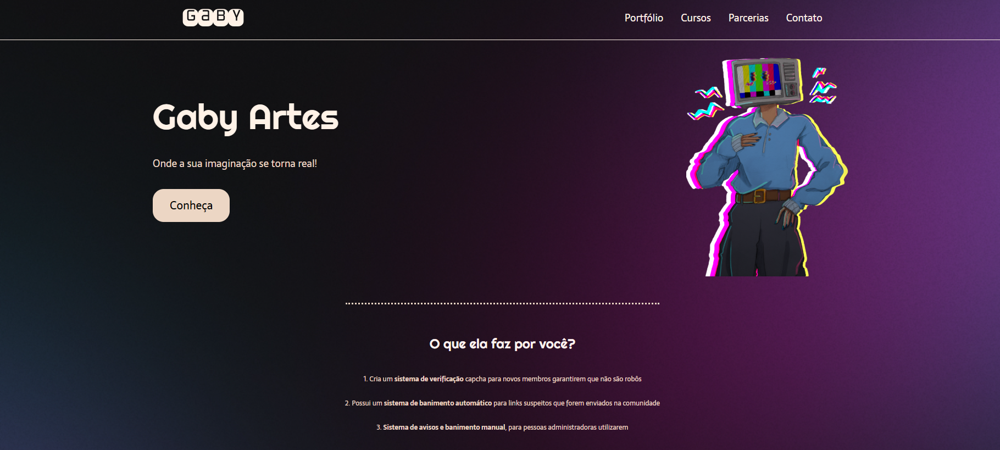
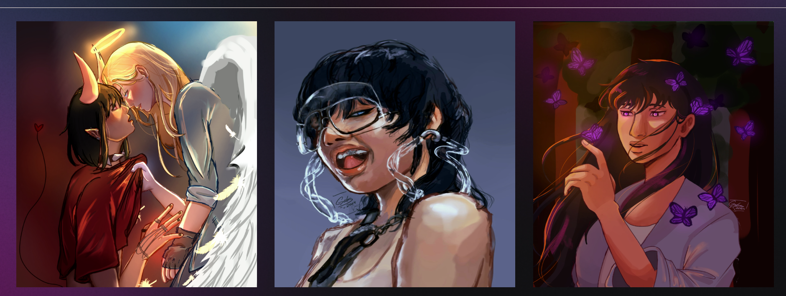

<h1 align="center"> Gaby Art </h1>

Projeto de um anúncio de curso de artes  

  

  

 

  

## 🚀 Tecnologias

Esse projeto foi desenvolvido com as seguintes tecnologias:

- HTML e CSS

## 💻 Projeto

O projeto foi feito com base no vídeo da Raffaela Ballerini.

- [Landing Page](https://www.youtube.com/watch?v=llF6vD-RljE)

## 🔖 Layout

  

## :memo: Licença

Esse projeto está sob a licença MIT.

---

Feito com ♥

